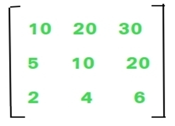

# GPU-Architecture-and-Computing-labs

    This repository is for my GPU Architecture and Computing Labs.

##  Table of Contents
- <a href ="#Overview">Overview</a>
- <a href ="#started"> Get Started</a>
- <a href ="#contributors">Contributors</a>
- <a href ="#license">License</a>

##  Project Overview 

## Lab 1

### C Refresher and Environment Setup

- To refresh the C programming language.
- To setup the environment for CUDA programming.
- Lab was to make code in c to accept a 2D array and returns the sum of the numbers formed by concatenating the elements(non negative) of each column.

  
  
  E.g. the given matrix returns 51362
  Explanation: ‘1052 + 20104 + 30206 = 51362’
  Input format: command line arguments as:
  nrows ncols nrows*ncols numbers
  For this matrix: 3 3 10 20 30 5 10 20 2 4 6
  The program should print 51362, nothing more. It must be compiled through nvcc successfully.

## Lab 2

### Matrix addition and matrix-vector multiplication

- Complete the provided matrix addition example, following these cases:

  A.   kernel1: each thread produces one output matrix element
  B.   kernel2: each thread produces one output matrix row
  C.   kernel3: each thread produces one output matrix column
  Analyze the pros and cons of each of the kernels above by using nvprof with large matrix sizes to validate your points. Collect your insights in a PDF report and explain them.

- Implement a matrix–vector multiplication kernel. Use one thread to calculate an output vector element.

Let both programs read testcases from a .txt file and print the output to another. Their pathes are to be provided as command line arguments. Sample test file and invoking command are to be attached to the e-learning page.

##  Get Started 

To get started with the project, follow these steps:

1. Clone the repository to your local machine.
2. Run the provided code.
3. Customize the code and add any additional features as needed.
4. Enjoy.

##  Contributors 

 
<table >
  <tr>
        <td align="center"><a href="https://github.com/Ahmed-H300"> <b>Ahmed Hany</b></a> </td>
  </tr>
  <tr>
        <td align="center"><a href="https://github.com/ahmedmadbouly186"> <b>Ahmed Madbouly</b></a> </td>
  </tr>
</table>

##  License 
This software is licensed under MIT License, See [License](https://github.com/Ahmed-H300/GPU-Architecture-and-Computing-labs/blob/main/LICENSE) for more information ©Ahmed Hany.
